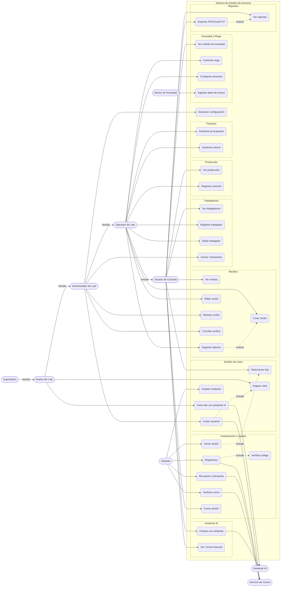

# Diagrama de Casos de Uso — Sistema de Gestión de Arrocera

> Actores derivados de los roles reales del sistema (`init_db.py` →
> `_seed_roles_and_permissions`) y casos de uso derivados de las rutas Flask
> (`routes_*.py`). Renderiza con la vista previa de Mermaid de VSCode.

## Actores

| Actor | Rol en el sistema | Acceso |
|-------|-------------------|--------|
| **Superadmin** | `superadmin` | Acceso total al sistema |
| **Dueño del Lote** | `duenio_lote` | Acceso completo a su(s) lote(s) |
| **Administrador de Lote** | `admin_lote` | Gestión operativa + eliminación/configuración |
| **Operador de Lote** | `operador_lote` | Crear/editar recibos, trabajadores, cosechas |
| **Usuario de Consulta** | `consulta_lote` | Solo lectura |
| **Visitante** | (no autenticado) | Registro / login / aceptar invitación |
| **Sensor de Humedad** | dispositivo externo | Envía lecturas (`/humedad/api/ingest`) |
| **Asistente IA** | sistema externo | Asiste en chat y creación de lotes |
| **Servicio de Correo** | sistema externo | Envía códigos e invitaciones |

## Diagrama

## Notas

- La **herencia entre actores** (flecha *hereda*) significa que cada actor
  superior dispone también de todos los casos de uso de los actores inferiores.
  Así, el *Dueño del Lote* puede hacer todo lo del *Administrador*, *Operador* y
  *Consulta*, más sus casos exclusivos.
- `<<include>>`: el caso base **siempre** ejecuta el incluido (p. ej. Registrarse
  incluye Verificar código).
- `<<extend>>`: el caso extensor ocurre **opcionalmente** (p. ej. Registrar
  labores extiende Crear recibo).
- Existe además la versión **PlantUML** (`diagrama_casos_de_uso.puml`), que
  produce un diagrama UML formal con la notación de óvalos y monigotes.
